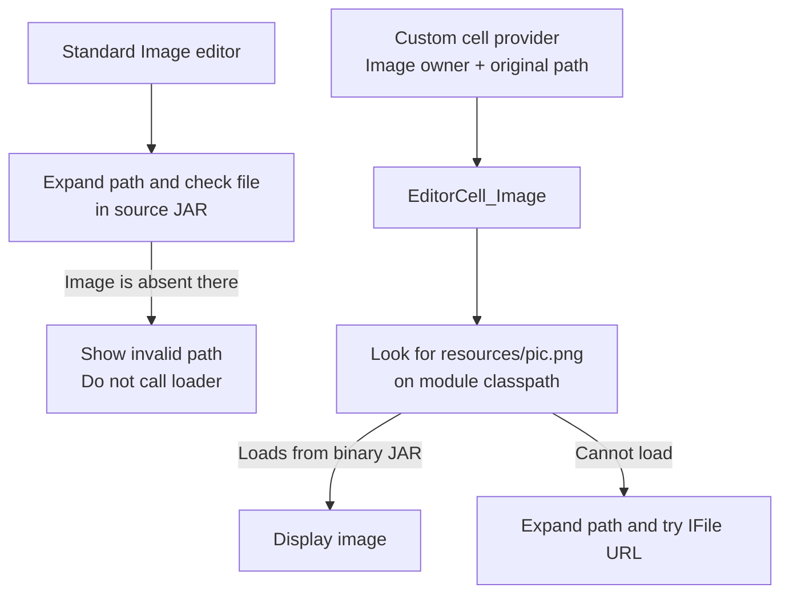

# How MPS loads images from modules

This note explains where to put module images, how MPS loads them from source directories and JARs, and why the standard
`Image` editor can reject an image that is correctly packaged.

It covers selected releases from MPS 2022.3.3 to 2026.1.1. It also covers master at commit
`060a562446473a8d995f2a6e59ce436b5aa8c0a0` (2026.2 EAP, build marker `262.SNAPSHOT`). The version section lists the
releases checked.

**Main finding, verified from source:** the standard `Image` editor and the image loader do not always look in the same
place. The editor can show `<invalid path>` before it calls a loader that could read the image from the module's JAR.
This problem remains in 2026.1.1 and the master revision checked here.

For a custom image editor, pass the module that owns the image and keep `${module}` in the path. Include the image in
that module's binary JAR. The loading code supports this approach in the later versions checked here. Compatibility is
**inferred from source comparison**; no IDE rendering test was run.

## One image, two ways to find it

Consider a module with this image path stored in a model:

```text
${module}/resources/pic.png
```

MPS has two ways to interpret this path:

1. **Expand the macro.** Replace `${module}` with a directory path based on the module descriptor.
2. **Look up a classpath resource.** Remove `${module}/` and ask the module's classloader for `resources/pic.png`.

A classpath resource is a file available through a module's classloader. It can be a loose file during development or an
entry in a JAR after packaging.

For the usual layout with separate binary and source JARs, the paths are:

| Location                                         | Image path                            |
| ------------------------------------------------ | ------------------------------------- |
| Development directory                            | `<module-dir>/resources/pic.png`      |
| Binary JAR                                       | `M.jar!/resources/pic.png`            |
| Path produced by macro expansion after packaging | `M-src.jar!/module/resources/pic.png` |

Here, `!/` means “inside this archive”. The third path points into the source JAR, but the build puts the image in the
binary JAR. That difference causes the validation problem.

The exact macro result depends on the deployment descriptor. Some modules use one JAR for both binaries and sources.
`MacrosFactory.forModule` uses `ModulesMiner.getSourceDescriptorFile` to find the source descriptor; it does not always
choose a file named `M-src.jar`. See [macro expansion][macros] and [source descriptor lookup][miner].

## How the image loader works

Since MPS 2023.3.0, `EditorCell_Image.ModuleImageDescriptor` loads a module-relative image in this order:

```text
load image(module, path)
  if path starts with "${module}/"
    look for the remaining path on the module's classpath
    if the image loads
      return it

  expand macros in path
  find the file with MPS IFile
  load the image from the file's URL
```

MPS `IFile` can represent a file inside a JAR. Java's `java.io.File` cannot.

**Keep `${module}` in the path passed to the cell.** If you expand it first, the loader skips the classpath lookup. For
example, passing `M-src.jar!/module/resources/pic.png` makes the loader try that file location directly. Passing the
correct module does not reverse this expansion. See [the loader][loader].

## Why the standard Image editor fails

The standard editor for `jetbrains.mps.lang.resources.Image` calls `Image.isValid()` before it creates an image cell. If
validation fails, it shows `<invalid path>` and never calls the loader.

For a packaged module, the problem is:



This diagram shows the failure case for `${module}/resources/pic.png` in 2025.1.4, 2026.1.1, and the master revision
checked here. If validation succeeds, the standard editor also calls `EditorCell_Image` with the original path. See [the
standard editor][image-editor] and [the loader][loader].

The validation code differs by version:

- In **2025.1.4**, it expands the path and checks `FileSystem.getInstance().getFile(path).exists()` using MPS `IFile`.
- In the **2025.2 and later releases checked here**, it uses `new java.io.File(path).exists()` instead. This check
  cannot find an entry inside a JAR, even if the image is copied to the expected archive location.

Both versions then construct `new ImageIcon(path)` and catch exceptions. They do not check the image's dimensions or
loading status. This is not a reliable test that an image can be decoded. Neither version checks the module's classpath.
See the [2025.1.4 behavior][image-behavior] and [2026.1.1 behavior][new-image-behavior].

There is another possible problem with temporary or execution models. The standard validator and the three-argument cell
factory use `node.getModel().getModule()`. After a node is copied, that module may no longer be the module that owns the
image. A custom provider can pass the image's actual owner explicitly.

## Where to put images

For `${module}/resources/pic.png`, preserve the path `resources/pic.png` when packaging:

```text
Development                     Packaged files
M/                              M.jar
├── M.msd                       ├── META-INF/module.xml
└── resources/                  └── resources/
    └── pic.png                     └── pic.png
                                M-src.jar
                                └── module/
                                    ├── M.msd
                                    └── models/...
```

**The directory names `icons` and `resources` are build defaults, not loader requirements.** The build-model generator
includes `icons/**, resources/**` by default. You can use `pictures/pic.png` if the build includes it at that same path
in the binary JAR. See [default resource selectors][build-defaults].

MPS's own generated build scripts use this layout: images go beside classes in the binary JAR; source descriptors and
models go under `module/` in the source JAR. See [binary packaging][binary-layout] and [source
packaging][source-layout].

Check these details when packaging:

- **Keep the full relative path and filename case.** A JAR entry named `pic.png` does not match `resources/pic.png`.
  This can happen if a fileset uses the `resources/` directory as its root.
- **Use the image owner's classpath.** Putting the image in an unrelated JAR elsewhere in the product is not enough. For
  MPS-managed classloaders, `ModuleRuntime.getOwnResource` checks the module's own resources. For other classloaders, it
  delegates to their `getResource` method. See [resource lookup][own-resource].
- **Keep portable image paths inside the module directory.** A filesystem path using `../` does not reliably map to a
  JAR resource name.
- **Do not rely on copying images to the source JAR.** The classpath lookup does not need such a copy. The newer
  `java.io.File` validator would still fail on an archive path.

An image that works during development may still be missing from the packaged product. In 2025.1.4, MPS-managed
classloaders can find loose resources under the module's source directory without copying them to `classes_gen`. This
support is also in 2023.3.2 and 2024.1.1, but not their `.0` releases.

The implementation is `ModuleClassLoaderSupport.calcClassPath`. For an unpackaged module, it adds a
`LocalResourceClassPathItem` after the normal Java classpath entries. This extra item loads resources, but does not load
classes. See [classloader setup][classpath] and [source-directory resource lookup][local-resources].

## How to write a custom image cell

Use the factory that takes the image's owner explicitly:

```java
return EditorCell_Image.createImageCell(
    context, displayedNode, resourceOwner, "${module}/resources/pic.png");
```

For this call to work:

- `resourceOwner` must identify the module that contains the image.
- The image must be available at `resources/pic.png` on that module's classpath, or at the fallback file location.
- The path must still contain `${module}` when passed to the factory.
- The custom editor must reach this call without first rejecting the image through the standard `Image.isValid()` check.

Handle missing paths before calling the factory. Although the `ModuleImageDescriptor` constructor marks its path as
nullable, `loadIcon` calls `startsWith` on it without a null check.

### Available API

`jetbrains.mps.nodeEditor.cells.EditorCell_Image` is in `lib/mps-editor.jar`. These signatures are present in 2025.1.4,
2026.1.1, and the master revision checked here:

```java
public static EditorCell_Image createImageCell(
    EditorContext editorContext, SNode node, String imageFileName);

public static EditorCell_Image createImageCell(
    EditorContext editorContext, SNode node,
    @NotNull SModule imageModule, String imagePath);

public static EditorCell_Image createImageCell(
    EditorContext editorContext, SNode node, @NotNull ImageDescriptor image);
```

`EditorContext` means `jetbrains.mps.openapi.editor.EditorContext`. `SNode` and `SModule` are MPS OpenAPI types. The
first overload gets the module from the node. If the node has no module, it returns an empty image cell.

The nested `ImageDescriptor` interface has the method `@Nullable Icon loadIcon(EditorContext context, SNode node)`.
`ModuleImageDescriptor` has constructors accepting either an `SModule` or an `SModuleReference`, plus the path. See [API
declarations][loader].

### Runtime requirements

Create the cell during normal editor cell creation. Loading is synchronous and can read files or JAR entries.

The file fallback requires the concrete `jetbrains.mps.nodeEditor.EditorContext`. It uses that context's icon cache,
with the expanded path as the key. The classpath lookup runs through `LanguageRegistry.withModuleRuntime`. This method
holds a lock while using module runtimes and skips runtimes that are unavailable.

That lock does not replace repository model access. Use normal model-access rules when reading nodes or resolving
modules. This research does not establish that arbitrary background-thread calls are safe.

`ModuleRuntime.getOwnResource` is marked provisional in its JavaDoc. The cell loader already calls it for you. If the
module runtime or resource is unavailable, the loader tries the file fallback. That fallback may fail for a packaged
module. See [runtime access][runtime-access] and [the loader][loader].

## Differences between versions

The table lists the release sources checked. It does not mean that every intermediate build was tested.

| Versions checked                                 | Image loading                                                                           | Standard validation                                      |
| ------------------------------------------------ | --------------------------------------------------------------------------------------- | -------------------------------------------------------- |
| 2022.3.3                                         | Expands the path, then uses a `java.io.File` URL. No classpath lookup.                  | Checks the expanded path with `IFile`.                   |
| 2023.2.0, 2023.2.3                               | Uses `IFile.getUrl()`, which supports archive URLs. No classpath lookup.                | Checks the expanded path with `IFile`.                   |
| 2023.3.0, 2024.1.0                               | Tries the module classpath first, then the expanded file path.                          | Checks the expanded source-descriptor path with `IFile`. |
| 2023.3.2, 2024.1.1, 2024.1.6, 2024.3.0           | Also exposes the source directory to MPS-managed resource lookup.                       | Still checks the expanded path with `IFile`.             |
| 2025.1.0, 2025.1.4                               | Keeps the classpath-first approach. The file fallback uses the descriptor's filesystem. | Still checks the expanded path with `IFile`.             |
| 2025.2.1, 2025.2.4, 2025.3.0, 2025.3.2, 2026.1.1 | Same `loadIcon` method as 2025.1.4.                                                     | Uses `java.io.File`; archive paths fail.                 |
| Master `060a56244647`                            | Same loader as 2026.1.1. Adds optional image sizing and alignment.                      | Same validator as 2026.1.1.                              |

The important source changes are:

- [MPS-29452, `968be29c6ce3`][classpath-change] adds classpath lookup in 2023.3.0. It addresses the change to resolving
  `${module}` through the source descriptor. The explicit source-descriptor lookup is absent in 2023.2.3.
- [MPS-37176, `f4f1fb4015d8`][source-resource-change] adds source-directory resource lookup. It is included in 2023.3.2
  and 2024.1.1. Patch versions therefore matter.
- [Commit `1392bd678c92`][filesystem-change] makes the file fallback use the descriptor's filesystem and handle a
  missing descriptor. It keeps the classpath lookup.
- [Commit `a65687c2b94e`][validation-change] changes validation to `java.io.File`. It is present in 2025.2.1 and the
  later releases checked here. It does not make validation agree with loading.

### Master compared with 2026.1.1

**Verified:** master at [commit `060a56244647`][master-revision] has the same image-loading and packaging behavior as
2026.1.1. The commit is dated September 18, 2026. It matched upstream master when checked on September 22, 2026. The
[application metadata][master-version] says 2026.2 EAP, `262.SNAPSHOT`. Because several builds can use that marker, use
the exact commit to identify the sources.

The comparison found:

- `EditorCell_Image.ModuleImageDescriptor` and the cell factories are unchanged.
- `Image__BehaviorDescriptor` and `Image_EditorBuilder_a` are identical. Validation still uses `java.io.File` and can
  stop loading. Image generation still uses the raw `file` property.
- `MacrosFactory`, `ModuleClassLoaderSupport`, and `LocalResourceClassPathItem` are unchanged. The source-descriptor
  lookup in `ModulesMiner` is also unchanged. Its other change concerns archive suffixes in Java model-root paths.
- `FileIcon` behavior is unchanged. The default build selector still includes `icons/**, resources/**`, and these
  resources still go into the binary JAR.

Master adds `public void EditorCell_Image.setAlignWithText(boolean enabled)`. The default is `false`. If enabled, the
`justify` layout scales the image by the editor font size divided by 13. It also adjusts vertical alignment to center
the image against the surrounding text. Existing factory calls do not enable this option automatically. It does not
change image lookup. See [the master image cell][master-loader].

**Inferred compatibility:** the custom-cell approach should continue to work on this master revision. The
`ModuleImageDescriptor.loadIcon` method is identical in 2025.1.4, 2025.2.4, 2025.3.2, 2026.1.1, and this master
revision. This is source evidence, not a runtime test or a promise about a future 2026.2 release.

## Other image behavior to know about

### File formats and the file chooser

In 2025.1.4 and 2026.1.1, the cell uses IntelliJ `IconLoader` for PNG and SVG. It uses Swing `ImageIcon` for other
extensions.

The 2025.1.4 image chooser lists `tiff, tif, gif, jpeg, jpg, png, ico`. It does not list SVG, although the cell can load
SVG. A format appearing in the chooser does not guarantee that it can be decoded.

`EditorUtil.createSelectImageButton` offers to copy files from outside the module into its `icons/` directory. An
overload accepts custom functions for expanding and shrinking paths. These are useful when the displayed node belongs to
a different module from the image. See [EditorUtil][editor-util].

### Generated icons

`FileIcon` uses a separate generation process. In 2025.1.4, `FileIcon.generate` expects module-relative images to be
available as module resources. It does not copy them into each generated package. Generated icon containers use paths
such as `/icons/actionMap.png`. Files with other kinds of paths are copied.

This behavior is present in 2024.3.0 and the later versions checked here. The source-directory resource support added to
2023.3.2 and 2024.1.1 does not include this generation change. See [MPS-33596][fileicon-change], [FileIcon
behavior][fileicon], and a [generated icon container][icon-container].

Include any dark-theme, scale, and New UI image variants in the build as well as the main image.

### Generating from an Image node

`Image.getImageForGeneration()` also differs from editor loading. In 2025.1.4 and 2026.1.1, it constructs an `ImageIcon`
from the raw `file` property. It does not expand macros or look on the module classpath. Master retains this behavior.

Fixing a custom editor therefore does not prove that image generation works. See the [2025.1.4][image-behavior] and
[2026.1.1][new-image-behavior] implementations.

## Evidence and limits

**Verified** means checked in source code, generated Java, or generated Ant layouts. **Inferred** means supported by
that code but not tested in a running IDE. No runtime rendering probe was performed.

A product still needs an integration test with its own module registration, classloaders, packaged files, and editor.
These findings concern image loading. They do not prove that an entire plugin is binary-compatible across MPS versions
or that other editor lifecycle changes are correct.

The resources language is in `languages/languageDesign/jetbrains.mps.lang.resources.jar`. The macro, module runtime, and
classloader code is in `lib/mps-core.jar`. The image cell is in `lib/mps-editor.jar`. See the distribution layout in
[`build/mpsBootstrapCore.xml`][distribution]. All source links identify a release tag or an exact commit.

[master-revision]: https://github.com/JetBrains/MPS-development/commit/060a562446473a8d995f2a6e59ce436b5aa8c0a0
[master-version]:
  https://github.com/JetBrains/MPS-development/blob/060a562446473a8d995f2a6e59ce436b5aa8c0a0/workbench/mps-workbench/source/idea/MPSApplicationInfo.xml
[master-loader]:
  https://github.com/JetBrains/MPS-development/blob/060a562446473a8d995f2a6e59ce436b5aa8c0a0/editor/editor-runtime/source/jetbrains/mps/nodeEditor/cells/EditorCell_Image.java
[loader]:
  https://github.com/JetBrains/MPS/blob/2025.1.4/editor/editor-runtime/source/jetbrains/mps/nodeEditor/cells/EditorCell_Image.java
[macros]:
  https://github.com/JetBrains/MPS/blob/2025.1.4/core/kernel/source/jetbrains/mps/util/MacrosFactory.java#L82-L129
[miner]:
  https://github.com/JetBrains/MPS/blob/2025.1.4/core/project/source/jetbrains/mps/library/ModulesMiner.java#L707-L740
[classpath]:
  https://github.com/JetBrains/MPS/blob/2025.1.4/core/kernel/source/jetbrains/mps/classloading/ModuleClassLoaderSupport.java#L41-L50
[local-resources]:
  https://github.com/JetBrains/MPS/blob/2025.1.4/core/project/source/jetbrains/mps/reloading/LocalResourceClassPathItem.java
[own-resource]:
  https://github.com/JetBrains/MPS/blob/2025.1.4/core/kernel/source/jetbrains/mps/smodel/runtime/ModuleRuntime.java#L98-L115
[runtime-access]:
  https://github.com/JetBrains/MPS/blob/2025.1.4/core/kernel/source/jetbrains/mps/smodel/language/LanguageRegistry.java#L775-L787
[build-defaults]:
  https://github.com/JetBrains/MPS/blob/2025.1.4/plugins/mps-build/pluginSolutions/jetbrains.mps.build.mps.pluginSolution/source_gen/jetbrains/mps/build/mps/pluginSolution/plugin/BuildGeneratorImpl.java#L3143-L3163
[binary-layout]: https://github.com/JetBrains/MPS/blob/2025.1.4/build/mpsBuild.xml#L162-L173
[source-layout]: https://github.com/JetBrains/MPS/blob/2025.1.4/build/mpsBuild.xml#L234-L251
[classpath-change]: https://github.com/JetBrains/MPS/commit/968be29c6ce3177026620cc9df48d608faae9f89
[source-resource-change]: https://github.com/JetBrains/MPS/commit/f4f1fb4015d8511baf17f1fb2e5bfc1fd861d675
[filesystem-change]: https://github.com/JetBrains/MPS/commit/1392bd678c92
[validation-change]: https://github.com/JetBrains/MPS/commit/a65687c2b94e
[image-editor]:
  https://github.com/JetBrains/MPS/blob/2025.1.4/languages/languageDesign/resources/source_gen/jetbrains/mps/lang/resources/editor/Image_EditorBuilder_a.java#L78-L129
[image-behavior]:
  https://github.com/JetBrains/MPS/blob/2025.1.4/languages/languageDesign/resources/source_gen/jetbrains/mps/lang/resources/behavior/Image__BehaviorDescriptor.java
[new-image-behavior]:
  https://github.com/JetBrains/MPS/blob/2026.1.1/languages/languageDesign/resources/source_gen/jetbrains/mps/lang/resources/behavior/Image__BehaviorDescriptor.java
[editor-util]:
  https://github.com/JetBrains/MPS/blob/2025.1.4/editor/editor-runtime/source_gen/jetbrains/mps/editor/runtime/EditorUtil.java#L47-L131
[fileicon-change]: https://github.com/JetBrains/MPS/commit/52bd70ba534f726b424137dd256fb889dfcb68ae
[fileicon]:
  https://github.com/JetBrains/MPS/blob/2025.1.4/languages/languageDesign/resources/source_gen/jetbrains/mps/lang/resources/behavior/FileIcon__BehaviorDescriptor.java
[icon-container]:
  https://github.com/JetBrains/MPS/blob/2025.1.4/languages/languageDesign/editor/source_gen/jetbrains/mps/lang/editor/structure/IconContainer.java
[distribution]: https://github.com/JetBrains/MPS/blob/2025.1.4/build/mpsBootstrapCore.xml
