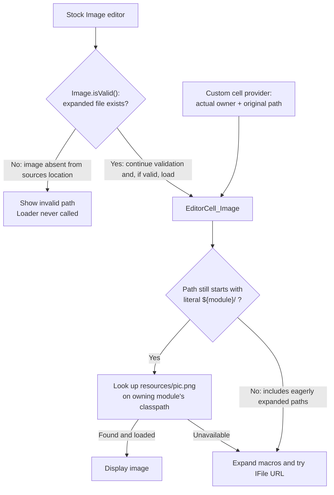

# Module images: source directories, packaged JARs, and editor validation

How does MPS resolve module-relative images in development and in packaged modules, and which changes matter across
versions? This note examines release sources from MPS 2022.3.3 through 2026.1.1, with detailed tracing of 2025.1.4 and
2026.1.1, plus master at commit `060a562446473a8d995f2a6e59ce436b5aa8c0a0` (2026.2 EAP, build marker `262.SNAPSHOT`).
The version table lists the specific revisions inspected; it does not imply testing every intervening build.

**Verified from source:** since 2023.3.0, `EditorCell_Image` first treats `${module}/path/to/image.png` as the resource
`path/to/image.png` on the owning module's classpath. Only if that lookup fails does it expand filesystem macros. The
stock `jetbrains.mps.lang.resources.Image` editor first calls a separate filesystem-based `isValid()` behavior. That
check can reject an image that the cell loader could successfully load from the binary JAR.

**Inferred compatibility:** a custom editor that supplies the owning module and the unexpanded module-relative path and
bypasses that validation gate should retain its image-loading behavior from 2025.1.4 through 2026.1.1. The entire
`ModuleImageDescriptor.loadIcon` method is identical in 2025.1.4, 2025.2.4, 2025.3.2, and 2026.1.1. This is source
evidence, not an end-to-end runtime test or a guarantee about future releases. The inspected master retains the same
loading implementation and validation mismatch; its additional image-cell behavior is described below.

## Two meanings of a module-relative image path

For a stored path `${module}/resources/pic.png`, these mechanisms differ:

| Mechanism                                                | Module being edited from sources                                  | Standard deployed module with separate sources JAR                                                |
| -------------------------------------------------------- | ----------------------------------------------------------------- | ------------------------------------------------------------------------------------------------- |
| `MacrosFactory.forModule(module).expandPath(path)`       | `<module-directory>/resources/pic.png`                            | `<module>-src.jar!/module/resources/pic.png`                                                      |
| `EditorCell_Image.ModuleImageDescriptor`, since 2023.3.0 | First tries resource `resources/pic.png`; then expanded file path | First tries resource `resources/pic.png` in the module runtime classpath; then expanded file path |
| Stock `Image.isValid()`                                  | Checks existence at the expanded file path                        | Checks the expanded source-descriptor location, not the binary resource location                  |

The deployed macro location is conditional on the deployment descriptor and packaging layout. It is not universally
`<module>-src.jar`. `MacrosFactory.forModule` explicitly asks `ModulesMiner.getSourceDescriptorFile` for the source
descriptor when a deployment descriptor exists. `ModulesMiner` supports both a separate sources archive and sources
under `module/` in the deployment archive itself. See [macro expansion][macros] and [source descriptor lookup][miner].

**Do not eagerly expand `${module}` before calling the image cell.** Its classpath branch recognizes the literal macro
prefix. Passing an already expanded `...-src.jar!/module/resources/pic.png` skips that branch. Supplying the correct
module alone does not undo premature expansion. See [the loader][loader].

## Development lookup and packaging requirements

For MPS-managed module classloaders in 2025.1.4, `ModuleClassLoaderSupport.calcClassPath` adds a resource-only path item
for the module source directory when the module is not packaged. Normal Java classpath items precede this additional
item. `LocalResourceClassPathItem` finds files below that directory; it does not define classes. Consequently, an image
next to the module descriptor can be found without first copying it into `classes_gen`. This behavior is also present in
2023.3.2 and 2024.1.1, but not their respective `.0` releases. See [classloader construction][classpath], [resource-only
lookup][local-resources], and the version table.

For deployment, include the image on the owning module's runtime classpath at the same path relative to its root:

```text
Sources                         Binary JAR entries
sample.msd                      META-INF/module.xml
resources/pic.png               resources/pic.png
icons/action.svg                icons/action.svg

Stored image path               Resource name used by the loader
${module}/resources/pic.png      resources/pic.png
${module}/icons/action.svg       icons/action.svg
```

**There is no loader requirement to use a directory named `icons` or `resources`.** Those names are build defaults. The
build-model generator creates a module resource selector with `icons/**, resources/**`. An image in `pictures/` can use
`${module}/pictures/pic.png` if the build explicitly includes it and preserves `pictures/pic.png` as the resource path.
A file working in the development editor does not establish that the build includes it. See [default resource
selectors][build-defaults].

The binary-JAR placement is deliberate. For example, MPS's generated build script places module resources beside
compiled classes in `jetbrains.mps.build.jar`; its source descriptor and models go under `module/` in the separate
source JAR. See [binary packaging][binary-layout] and [source packaging][source-layout]. Merely declaring or selecting
an image does not substitute for including its resource in the build layout.

Practical consequences:

- Preserve the complete relative path, including directories and filename case. Selecting the `resources/` directory as
  a fileset root and thereby placing `pic.png` at the JAR root does not satisfy a lookup for `resources/pic.png`.
- Place the resource in the owning module's classpath, not just an arbitrary JAR shipped somewhere in the product.
  `ModuleRuntime.getOwnResource` uses `ModuleClassLoader.getOwnResource` for MPS-managed loaders; dependencies are not a
  substitute for the owning module's resource. For other classloaders it delegates to their `getResource`.
- Keep resources within the module directory when authoring portable `${module}` paths. Filesystem paths involving `../`
  are not a portable mapping to JAR resource names.
- Copying images into the sources JAR is unnecessary for classpath-first loading. It is not a durable repair of the
  stock validator: the `java.io.File` validator in the inspected 2025.2-and-later releases cannot interpret JAR entries.

The first three points follow from the path transformation and [own-resource lookup][own-resource]; the last follows
from the validator implementations below. No custom-packaging runtime probe was performed.

## Version differences

| Release sources inspected                          | Cell loading and development behavior                                                                                 | Stock `Image.isValid()`                                                  |
| -------------------------------------------------- | --------------------------------------------------------------------------------------------------------------------- | ------------------------------------------------------------------------ |
| 2022.3.3                                           | Expands macros, then converts `java.io.File` to a URL for `IconLoader`; no module-runtime resource lookup             | Expanded path checked with MPS `IFile`                                   |
| 2023.2.0, 2023.2.3                                 | Uses `IFile` and `IFile.getUrl()` for the expanded path, allowing a proper archive URL; no classpath-first lookup     | Expanded path checked with MPS `IFile`                                   |
| 2023.3.0, 2024.1.0                                 | Classpath-first lookup for literal `${module}/...`, then `IFile` fallback; no source-directory resource-only item yet | Expanded source-descriptor path checked with MPS `IFile`                 |
| 2023.3.2, 2024.1.1, 2024.1.6, 2024.3.0             | Same order, plus source-directory resource-only classpath item for unpackaged MPS-managed modules                     | Same filesystem-based validation                                         |
| 2025.1.0, 2025.1.4                                 | Same resource-first design; 2025.1.4 fallback uses the descriptor's filesystem and guards a missing descriptor        | Same filesystem-based validation                                         |
| 2025.2.1, 2025.2.4, 2025.3.0, 2025.3.2, 2026.1.1   | Same `loadIcon` implementation as 2025.1.4                                                                            | Uses `new java.io.File(expandedPath).exists()`; still no resource lookup |
| Master `060a56244647` (2026.2 EAP, `262.SNAPSHOT`) | Same loader as 2026.1.1; adds opt-in font-relative image sizing and alignment                                         | Same validator as 2026.1.1; mismatch remains                             |

The significant changes can be verified independently:

- [MPS-29452, commit `968be29c6ce3`][classpath-change], included in 2023.3.0, adds the module-runtime lookup. Its commit
  message explicitly connects it to `${module}` resolving against module sources. `MacrosFactory.forModule` in 2023.2.3
  does not yet perform the explicit source-descriptor redirection present in 2023.3.0.
- [MPS-37176, commit `f4f1fb4015d8`][source-resource-change], included in 2023.3.2 and 2024.1.1, adds the resource-only
  source-directory lookup and adjusts image loading. Do not infer maintenance-release behavior from the major/minor
  version alone.
- [Commit `1392bd678c92`][filesystem-change] changes the loader's fallback to use the module descriptor's filesystem. It
  does not remove the classpath branch.
- [Commit `a65687c2b94e`][validation-change], present in 2025.2.1 and subsequent inspected tags, changes `Image`
  validation from `IFile` to `java.io.File`. It does not align validation with image loading.

### Master compared with 2026.1.1

**Verified:** master at [commit `060a56244647`][master-revision], dated September 18, 2026, retains the image-resolution
and packaging behavior described for 2026.1.1. Its application metadata identifies 2026.2 EAP with build marker
`262.SNAPSHOT`; the exact commit disambiguates this non-unique snapshot marker. The upstream master ref matched this
commit when checked on September 22, 2026. See [application metadata][master-version].

- The entire `EditorCell_Image.ModuleImageDescriptor` implementation is unchanged, including classpath-first lookup,
  fallback, and constructors. The cell factories are also unchanged.
- `Image__BehaviorDescriptor` and `Image_EditorBuilder_a` are identical to 2026.1.1. The stock editor still gates
  loading on `java.io.File`-based validation; `Image.getImageForGeneration()` still uses the raw property.
- `MacrosFactory`, `ModuleClassLoaderSupport`, and `LocalResourceClassPathItem` are unchanged. The source-descriptor
  lookup in `ModulesMiner` is unchanged; a separate change there concerns archive suffixes on Java model-root paths.
- `FileIcon` behavior is unchanged. The build resource selector still includes `icons/**, resources/**`, and the
  generated binary-JAR layout still includes these resources alongside classes.

The relevant addition is `public void EditorCell_Image.setAlignWithText(boolean enabled)`. It defaults to `false`. When
enabled, `justify` layout scales icon dimensions by the effective editor font size divided by 13, and the cell computes
its descent to align the image's vertical center with surrounding text. This changes presentation when opted in, not
where images are loaded from. A custom provider using the existing factories does not enable it automatically. See [the
master image-cell source][master-loader].

**Inferred:** the custom-provider approach using the actual resource owner and an unexpanded `${module}/...` path
remains applicable to this master revision. No runtime rendering probe was performed. This comparison establishes
MPS-side source behavior, not binary compatibility of an entire plugin or behavior of a future 2026.2 release.

## Why the stock Image editor reports an invalid path

In 2025.1.4, the generated [Image editor][image-editor] calls `Image.isValid()` before constructing the image cell. On
failure it constructs the red `<invalid path>` cell instead. The valid branch passes the original property to
`EditorCell_Image.createImageCell(context, node, imagePath)`; the loader is never reached on the invalid branch.

For a packaged module with `resources/pic.png` in its binary JAR, the two editor paths diverge before loading. This flow
summarizes the verified 2025.1.4, 2026.1.1, and pinned master implementations:



The binary-JAR resource can be reachable even when the stock editor stops at the first check. Preserving the literal
macro lets a custom provider reach the classpath lookup; pre-expanding it sends loading directly to the file fallback.
See [the loader][loader] and [the validation behavior][image-behavior].

The [2025.1.4 behavior][image-behavior] obtains the module from the image node's own model, expands the stored path, and
calls `FileSystem.getInstance().getFile(path).exists()`. It then constructs `new ImageIcon(path)` inside a catch block.
It does not consult the module runtime or the cell loader, nor check image dimensions or loading status. This is not a
reliable image-decoding test.

The [2026.1.1 behavior][new-image-behavior] retains that algorithm but uses `java.io.File` for the existence test. Its
editor retains the `isValid()` gate. Therefore the validator/loading mismatch remains in the inspected later release;
moving resources into an archive at the expanded path does not make `java.io.File` understand that archive.

A separate failure occurs when a node is copied into a temporary or execution model. Both the stock validator and the
three-argument cell factory derive the module from `node.getModel().getModule()`. That can be a different module from
the one owning the image. Supplying the image's actual owner to the four-argument factory addresses this distinction; it
does not require the displayed node to belong to the resource-owning module.

## API for a custom image editor

The relevant class is `jetbrains.mps.nodeEditor.cells.EditorCell_Image` in `lib/mps-editor.jar`. These factories are
present in 2025.1.4 and 2026.1.1:

```java
public static EditorCell_Image createImageCell(
    EditorContext editorContext, SNode node, String imageFileName);

public static EditorCell_Image createImageCell(
    EditorContext editorContext, SNode node,
    @NotNull SModule imageModule, String imagePath);

public static EditorCell_Image createImageCell(
    EditorContext editorContext, SNode node, @NotNull ImageDescriptor image);
```

`EditorContext` is `jetbrains.mps.openapi.editor.EditorContext`; `SNode` and `SModule` are MPS OpenAPI types.
`ImageDescriptor` is the nested interface with `@Nullable Icon loadIcon(EditorContext context, SNode node)`.
`ModuleImageDescriptor` has constructors taking either an `SModule` or an `SModuleReference` plus a path. See [the
declarations and implementation][loader].

For a custom cell provider, the essential call is:

```java
return EditorCell_Image.createImageCell(
    context, displayedNode, resourceOwner, "${module}/resources/pic.png");
```

This assumes `resourceOwner` resolves to the actual module, the path is nonempty, the resource is packaged as described
above, and the editor does not first reject it with stock `Image.isValid()` or another descriptor-relative existence
check. Despite a nullable constructor annotation, `ModuleImageDescriptor.loadIcon` dereferences its path with
`startsWith`; callers should handle missing paths themselves.

Use this API within the normal editor cell-creation lifecycle. Loading is synchronous and can perform resource I/O. The
fallback casts the editor context to `jetbrains.mps.nodeEditor.EditorContext` and uses its icon cache, keyed by the
expanded path. The classpath branch executes inside `LanguageRegistry.withModuleRuntime`, which protects runtime access
with its own read lock and skips unavailable runtimes. That lock is not a replacement for repository model access when
resolving modules or reading nodes. No general background-thread safety contract is established here.

`ModuleRuntime.getOwnResource` is explicitly marked provisional in its JavaDoc; the cell API already encapsulates its
use. Successful resource loading returns before macro expansion. If the runtime or resource is unavailable, the loader
falls back to filesystem resolution, which may fail for a packaged module. An absent module in the three-argument
factory yields an empty image cell. See [runtime access][runtime-access] and [the loader][loader].

## Related image mechanisms

**File formats and selection.** In 2025.1.4 and 2026.1.1, the cell uses IntelliJ `IconLoader` for PNG/SVG and Swing
`ImageIcon` for other extensions. The 2025.1.4 `EditorUtil.MPS_EDITOR_IMAGE_FORMATS` chooser list includes
`tiff, tif, gif, jpeg, jpg, png, ico` and omits SVG, even though the cell has an SVG branch. A chooser filter is not a
guarantee that every listed format decodes successfully. `EditorUtil.createSelectImageButton` offers to copy an image
outside the module into its `icons/` directory. It also has an overload accepting explicit path shrink/expand callbacks,
useful when the displayed node's module is not the image owner. See [EditorUtil][editor-util].

**Generated icons are a separate pipeline.** In 2025.1.4, `FileIcon.generate` does not copy module-relative image files
into each generated package; it expects them to be available as module resources. Generated icon containers refer to
paths such as `/icons/actionMap.png`. Non-module-relative files follow a copying path. This change is present in
2024.3.0 and subsequent inspected releases; the source-resource bridge backport alone does not imply the same generation
behavior in 2023.3/2024.1. See [MPS-33596][fileicon-change], [FileIcon behavior][fileicon], and a [generated icon
container][icon-container]. Include relevant dark, scale, and New UI variants in resource packaging as well as the
primary image.

**Image generation is also separate from editor loading.** `Image.getImageForGeneration()` in 2025.1.4 and 2026.1.1
constructs an `ImageIcon` from the raw `file` property without macro expansion or module-runtime lookup. A custom editor
cell therefore does not establish that generation from the same `Image` node works. See the two behavior implementations
cited above.

## Evidence and limits

All behavior described as verified was established by reading release-tagged or commit-pinned source, generated Java, or
generated Ant layouts. No MPS IDE or packaged-product rendering probe was run. Application-specific module registration,
classloader configuration, resource contents, and cell lifecycle still require integration verification. Compatibility
claims concern image loading; they do not validate other editor lifecycle changes or promise binary compatibility of an
entire language/plugin across MPS releases.

The resources language lives in `languages/languageDesign/jetbrains.mps.lang.resources.jar`; the macro, module runtime,
and classloader implementations are in `lib/mps-core.jar`. Distribution mappings are recorded in
[`build/mpsBootstrapCore.xml`][distribution]. Source links below use release tags or exact commits, and the named
classes and methods provide stable search anchors.

[master-revision]: https://github.com/JetBrains/MPS-development/commit/060a562446473a8d995f2a6e59ce436b5aa8c0a0
[master-version]:
  https://github.com/JetBrains/MPS-development/blob/060a562446473a8d995f2a6e59ce436b5aa8c0a0/workbench/mps-workbench/source/idea/MPSApplicationInfo.xml
[master-loader]:
  https://github.com/JetBrains/MPS-development/blob/060a562446473a8d995f2a6e59ce436b5aa8c0a0/editor/editor-runtime/source/jetbrains/mps/nodeEditor/cells/EditorCell_Image.java
[loader]:
  https://github.com/JetBrains/MPS/blob/2025.1.4/editor/editor-runtime/source/jetbrains/mps/nodeEditor/cells/EditorCell_Image.java
[macros]:
  https://github.com/JetBrains/MPS/blob/2025.1.4/core/kernel/source/jetbrains/mps/util/MacrosFactory.java#L82-L129
[miner]:
  https://github.com/JetBrains/MPS/blob/2025.1.4/core/project/source/jetbrains/mps/library/ModulesMiner.java#L707-L740
[classpath]:
  https://github.com/JetBrains/MPS/blob/2025.1.4/core/kernel/source/jetbrains/mps/classloading/ModuleClassLoaderSupport.java#L41-L50
[local-resources]:
  https://github.com/JetBrains/MPS/blob/2025.1.4/core/project/source/jetbrains/mps/reloading/LocalResourceClassPathItem.java
[own-resource]:
  https://github.com/JetBrains/MPS/blob/2025.1.4/core/kernel/source/jetbrains/mps/smodel/runtime/ModuleRuntime.java#L98-L115
[runtime-access]:
  https://github.com/JetBrains/MPS/blob/2025.1.4/core/kernel/source/jetbrains/mps/smodel/language/LanguageRegistry.java#L775-L787
[build-defaults]:
  https://github.com/JetBrains/MPS/blob/2025.1.4/plugins/mps-build/pluginSolutions/jetbrains.mps.build.mps.pluginSolution/source_gen/jetbrains/mps/build/mps/pluginSolution/plugin/BuildGeneratorImpl.java#L3143-L3163
[binary-layout]: https://github.com/JetBrains/MPS/blob/2025.1.4/build/mpsBuild.xml#L162-L173
[source-layout]: https://github.com/JetBrains/MPS/blob/2025.1.4/build/mpsBuild.xml#L234-L251
[classpath-change]: https://github.com/JetBrains/MPS/commit/968be29c6ce3177026620cc9df48d608faae9f89
[source-resource-change]: https://github.com/JetBrains/MPS/commit/f4f1fb4015d8511baf17f1fb2e5bfc1fd861d675
[filesystem-change]: https://github.com/JetBrains/MPS/commit/1392bd678c92
[validation-change]: https://github.com/JetBrains/MPS/commit/a65687c2b94e
[image-editor]:
  https://github.com/JetBrains/MPS/blob/2025.1.4/languages/languageDesign/resources/source_gen/jetbrains/mps/lang/resources/editor/Image_EditorBuilder_a.java#L78-L129
[image-behavior]:
  https://github.com/JetBrains/MPS/blob/2025.1.4/languages/languageDesign/resources/source_gen/jetbrains/mps/lang/resources/behavior/Image__BehaviorDescriptor.java
[new-image-behavior]:
  https://github.com/JetBrains/MPS/blob/2026.1.1/languages/languageDesign/resources/source_gen/jetbrains/mps/lang/resources/behavior/Image__BehaviorDescriptor.java
[editor-util]:
  https://github.com/JetBrains/MPS/blob/2025.1.4/editor/editor-runtime/source_gen/jetbrains/mps/editor/runtime/EditorUtil.java#L47-L131
[fileicon-change]: https://github.com/JetBrains/MPS/commit/52bd70ba534f726b424137dd256fb889dfcb68ae
[fileicon]:
  https://github.com/JetBrains/MPS/blob/2025.1.4/languages/languageDesign/resources/source_gen/jetbrains/mps/lang/resources/behavior/FileIcon__BehaviorDescriptor.java
[icon-container]:
  https://github.com/JetBrains/MPS/blob/2025.1.4/languages/languageDesign/editor/source_gen/jetbrains/mps/lang/editor/structure/IconContainer.java
[distribution]: https://github.com/JetBrains/MPS/blob/2025.1.4/build/mpsBootstrapCore.xml
